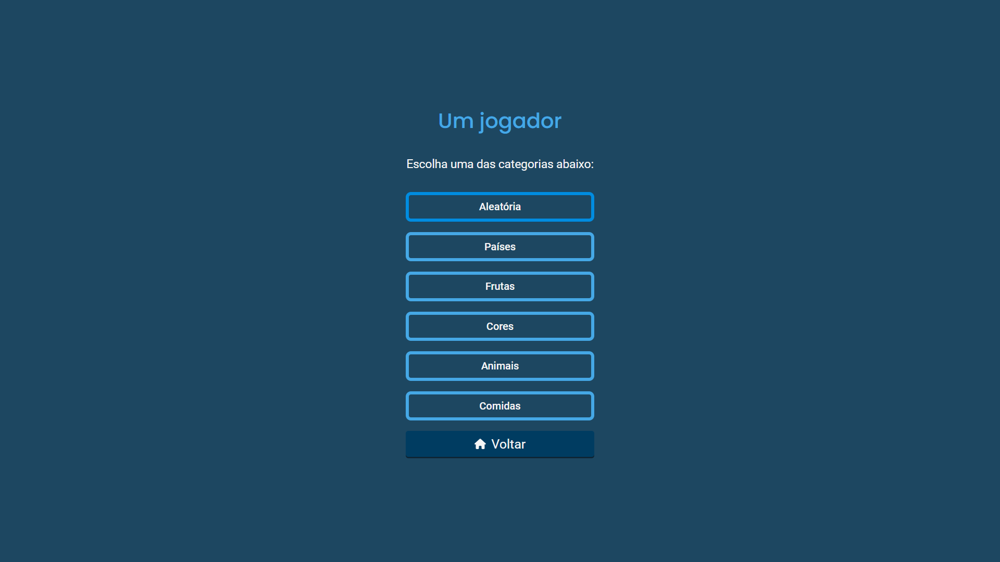
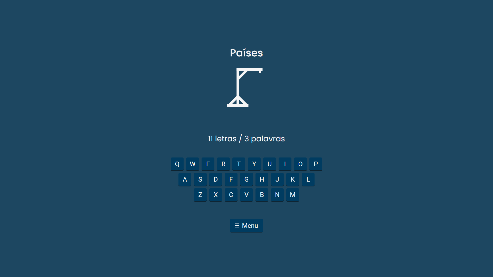
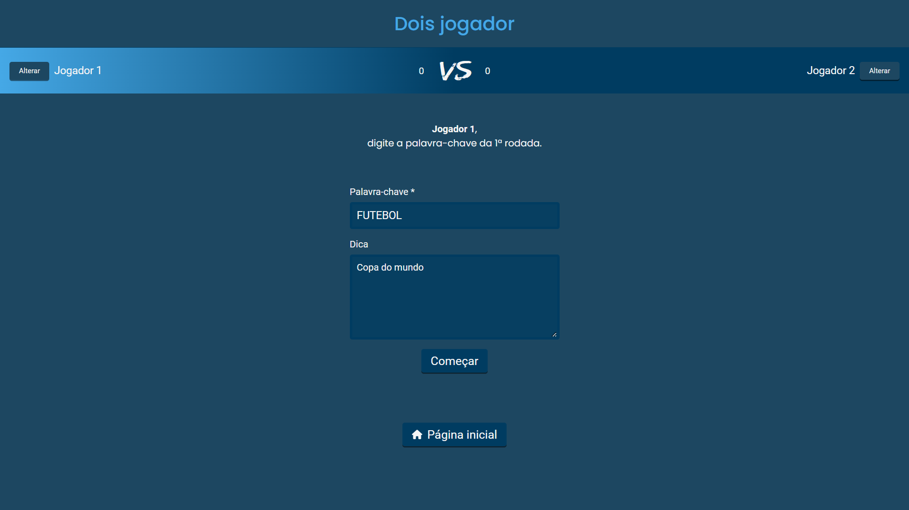
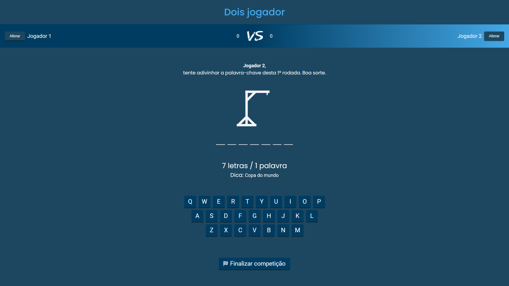

# Hangman-game (Jogo da forca)

<h1 align="center">
  
</h1>

## 💻 Sobre o projeto

Projeto pessoal, que comecei a fazer para por em prática conhecimentos adiquiridos nos estudos sobre [ReactJs](https://reactjs.org/).

## 🧪 Tecnologias

- [ReactJs](https://reactjs.org/);
- [TypeScript](https://www.typescriptlang.org/);
- [Firebase](https://firebase.google.com/) (futuramente, será usado para autenticação no modo multijogador);
- [Supabase](https://supabase.com/) (futuramente, será usado no modo multijogador).

## ⚙️ Funcionalidades

- Um jogador;

  
  

O jogador tem algumas opções de categorias como "Países", "Comidas", entre outras. São palavras predefinidas. Além dessas, a primeira opção é "Aleatória", onde a cada rodada, será selecionada uma categoria aleatória e uma palavra aleatória dessa categoria.

- Dois jogadores;

  
  

Padrão de jogos de forca, uma pessoa digita uma palavra e a outra tenta acertar, e vice-versa.

- Multiplayer.
Ainda em desenvolvimento.